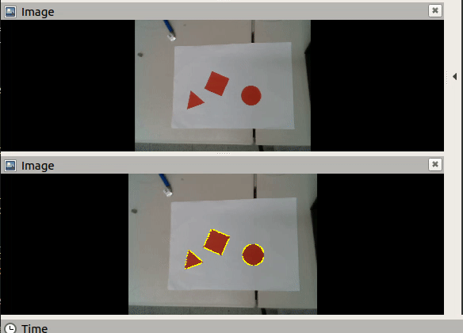
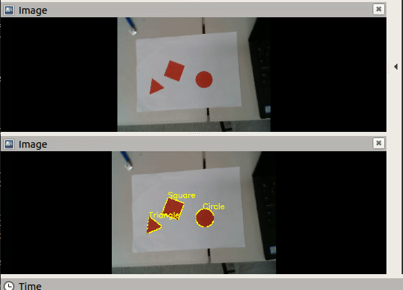
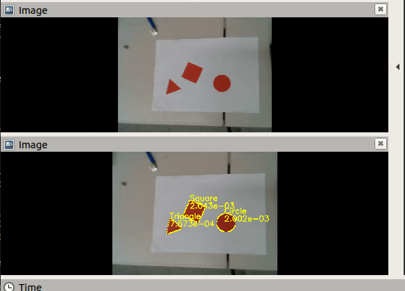

# How to run

```bash
$ cd catkin_ws
$ catkin_make
$ source devel/setup.bash
$ rosrun me212cv object_detection.py
```
Open another terminal.
```bash
$ rosbag play lab5_bag.bag
```


# Result
## draw_contours
  


## detect_shape  
  

## calculate_size 
  
